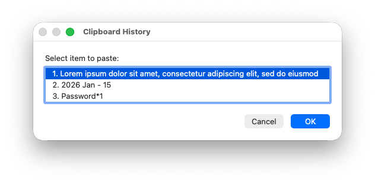

# Clipboard History

A super lightweight macOS clipboard history manager. Stores up to 50 clipboard entries and lets you browse and paste them via a native macOS dialog.

No third-party dependencies, no cloud sync, just a single Go binary running locally.



## Requirements

- macOS 12 or later
- Go 1.22 or later (only needed to build)

## Installation

### 1. Clone the repo

```bash
git clone <repo-url> ~/.clipboard-history
```

### 2. Build the binary

```bash
cd ~/.clipboard-history && go build -o clipboard-history .
```

### 3. Install the Services menu trigger

```bash
~/.clipboard-history/clipboard-history build-service
```

This creates an Automator Quick Action at `~/Library/Services/Clipboard History.workflow`.

### 4. Set up the background monitor

Copy the LaunchAgent plist, replacing `YOUR_USERNAME` with your actual username:

```bash
sed "s/YOUR_USERNAME/$(whoami)/g" \
    ~/.clipboard-history/com.clipboard-history.monitor.plist \
    > ~/Library/LaunchAgents/com.clipboard-history.monitor.plist
```

Load it so it starts now and on every login:

```bash
launchctl bootstrap gui/$(id -u) ~/Library/LaunchAgents/com.clipboard-history.monitor.plist
```

### 5. Grant permissions

On first use macOS will prompt for:

- **Accessibility** — allows `osascript` (via System Events) to simulate `Cmd+V` to paste
- **Automation** — allows `osascript` to control System Events

You can also grant these in advance under **System Settings, Privacy & Security**.

### 6. Assign a keyboard shortcut (recommended)

1. Open **System Settings, Keyboard, Keyboard Shortcuts**
2. Select **Services** in the left sidebar
3. Scroll to find **Clipboard History** (under General)
4. Double-click the empty space to the right of it
5. Press your desired shortcut (e.g. `Cmd + Ctrl + V`)
6. Click **Done**

If the shortcut doesn't trigger, another app may have a conflicting binding — try a different combination.

## Usage

Trigger via the assigned keyboard shortcut, or from any app's **Services** menu. A dialog lists your recent clipboard items — select one to paste it into the active app.

## How it works

A single Go binary with three subcommands:

- **`monitor`** — background daemon that polls `pbpaste` every second, base64-encodes entries, deduplicates, and writes to `~/.clipboard-history/history` (capped at 50 items)
- **`pick`** — reads the history file, shows a native macOS `osascript` "choose from list" dialog, then restores the selected item to clipboard via `pbcopy` and auto-pastes with `Cmd+V`
- **`build-service`** — generates the Automator Quick Action plist at `~/Library/Services/Clipboard History.workflow`

No runtime dependencies — only macOS built-ins (`pbpaste`, `pbcopy`, `osascript`). Base64 encoding handles multiline text and special characters safely in the flat history file. `pick` collapses whitespace and truncates to 72 chars for display but restores the full original content on paste.

To run the subcommands directly:

```bash
~/.clipboard-history/clipboard-history monitor &   # start the monitor daemon
~/.clipboard-history/clipboard-history pick         # launch the chooser dialog
```

## Uninstall

```bash
launchctl bootout gui/$(id -u) ~/Library/LaunchAgents/com.clipboard-history.monitor.plist
rm ~/Library/LaunchAgents/com.clipboard-history.monitor.plist
rm -rf ~/Library/Services/Clipboard\ History.workflow
rm -rf ~/.clipboard-history
```

Then revoke the permissions granted during installation:

1. Open **System Settings, Privacy & Security, Accessibility** and remove `osascript`
2. Open **System Settings, Privacy & Security, Automation** and remove `osascript`
